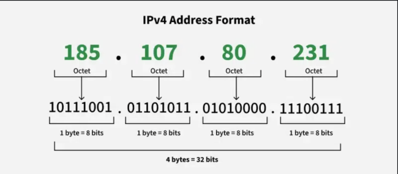
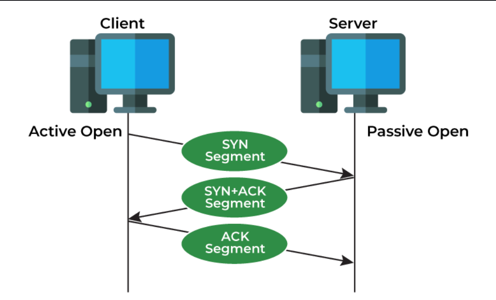
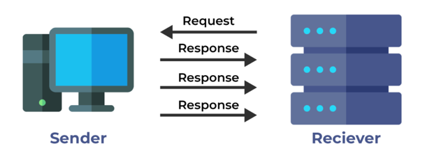
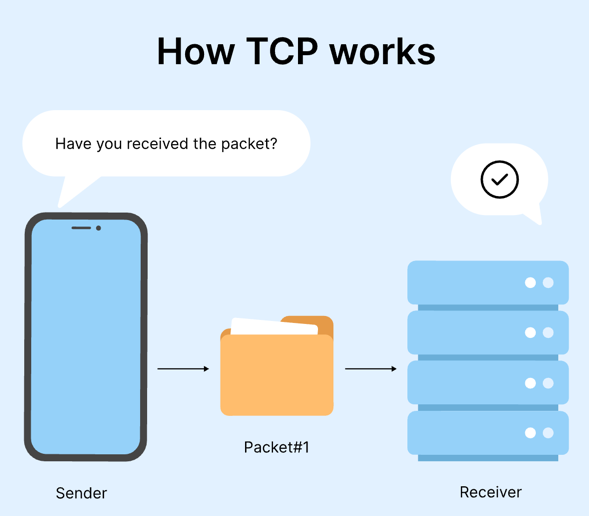
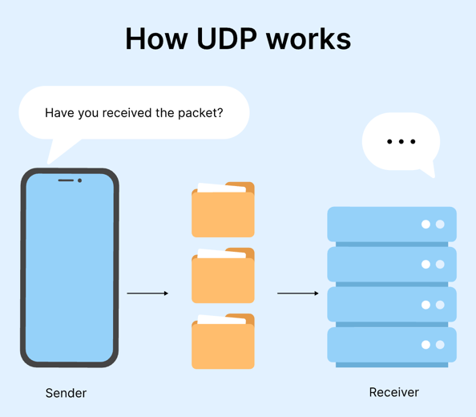
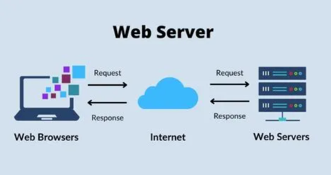
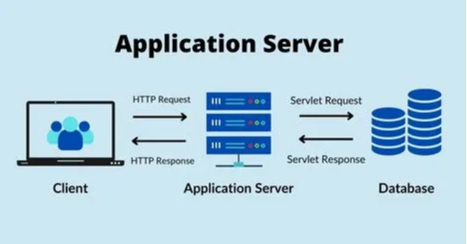

# 🎯 핵심 키워드

- IP
- PORT
- CIDR
- TCP와 UDP 차이
- Web Server와 WAS의 차이

---

## IP
IP 주소는 통신을 위해 인터넷 프로토콜을 사용하는 컴퓨터 네트워크에 연결된

각 장치에 할당된 고유한 숫자 문자열이다.

- 장치가 네트워크를 통해 데이터를 송수신할 수 있도록 하는 식별자 역할을 한다.
- 데이터가 올바른 대상에 도달하도록 보장한다.

### IP 주소의 종류
IP 주소는 구조, 목적 사용되는 네트워크 유형에 따라 여러 가지 방법으로 분류된다.

**1. 주소 지정 방식 기반 (IPv4, IPv6)**

- **IPv4**
  - 가장 일반적인 IP 주소 형태
  - 예를 들어, 192.158.1.38 에서 각 숫자 세트는 0~255까지 범위가 될 수 있다.
  - 점으로 구분된 각 구간을 옥텟이라고 부른다.
  - 192는 첫 번째 옥텟, 168은 두 번째 옥텟...
  - 네트워크 부분은 처음 1~3 옥텟으로 표현되고 나머지는 호스트(장치)를 식별하기 위한 옥텟
  
 

- **IPv6**
  - IPv6는 IPv4 주소의 부족을 해결하기 위해 만들어졌다.
  - 32비트 대신 128비트를 사용해 훨씬 더 많은 IP 조합을 제공
  - 16진수 숫자로 구성된 8개의 그룹으로 표현된다. 각 그룹은 16비트로 구성되어 있다.
  - IPv6 주소 예 : 2001:0db8:85a3:0000:0000:8a2e:0370:7334

### IP 주소 고갈 위험
위에서 설명했던 IPv4는 총 43억개의 IP를 나타낼 수 있다.

하지만, 현대에 들어서는 집집마다 컴퓨터, 와이파이 공유기 등 IP 주소를 할당받은 전자 기기들을

여러 대 가지고 있다. 즉, 43억개의 숫자는 사실상 고갈된 상태이다.

IPv6 또한 비용 문제로 아직 완전히 대체된 것이 아니다.

그런데 어떻게 문제 없이 아직 IP를 사용할 수 있을까?

그 이유는 수학적인 트릭을 이용해 기존 주소 체계를 좀 달리해서 사용하고 있기 때문이다.

아래는 이 트릭에 대한 설명이다.

### 공인 IP, 사설 IP, 고정 IP, 유동 IP

**고정 IP**
- 말 그대로 변하지 않고 컴퓨터에 고정적으로 부여된 IP
- 한 번 부여되면 IP 반납 전까지 다른 장비에 부여할 수 없다.
- 고유의 IP이기에 보안성이 우수하다 -> 보안이 필요한 업체나 기관에서 주로 사용

**유동 IP**
- 말 그대로 변하는 IP이다.
- 인터넷 사용자 모두에게 고정 IP를 부여해 주기 힘들기 때문에, 일정한 주기 또는 사용자 
  들이 인터넷에 접속하는 매 순간마다 사용하고 있지 않은 IP 주소를 임시로 발급해준다.

**공인 IP**
- IP 주소를 우리가 부여하지 않고 ICANN이라는 국제 기관에서 나라별로 사용할 IP 대역을 관리하고
- 우리 나라 같은 경우 KISA에서 국내 IP 주소들을 관리하고 있다.
- 이 IP를 ISP(KT, LG, SKT와 같은 통신업체)가 부여받고, 우리는 통신사 가입을 통해 
  IP를 제공받아서 인터넷을 사용할 수 있는 것이다.

**사설 IP**
- 집에서 공유기를 사용할 시 공유기에 연결되어 있는 가정이나 회사 각 네트워크 기기에서 사설 IP를 할당받는다.
- 어떤 네트워크 안에서 내부적으로 사용되는 고유한 주소이다.
- 오직 하나의 네트워크 안에서 유일하다.
- 내부에서만 접근 가능하다. (외부 접근 x)
- 회사에서 주로 사설IP를 활용해 사설망을 구축해놓는다.

이를 통해 기존 주소 체계 그대로 IP를 받아와 사용하는 것이 아니라
상황에 따라 다양한 트릭을 적용해 IP를 절약할 수 있다.

IP는 다시 한 번 할당 방법에 따라 정적 vs 동적으로 구분할 수 있다.

**정적 IP 주소**
- 장치에 영구적으로 할당되며, 일반적으로 서버나 일정한 주소가 필요한 장치에 중요하다.
- 위에서 살펴봤던 고유 IP가 이에 해당된다.

**동적 IP 주소**
- DHCP(동적 호스트 구성 프로토콜)을 통해 네트워크에 연결된 장치에 자동으로 할당되는 IP 주소
- 스마트폰, 노트북, 태블릿 등은 네트워크에 연결될 때 마다 IP 주소가 변경되어도 
  장치가 네트워크를 통해 데이터를 주고 받을 때 큰 영향을 받지 않기에 
  DHCP를 통해 동적으로 IP 주소를 할당받는다.

참고 자료:

https://www.geeksforgeeks.org/what-is-an-ip-address/

## PORT
포트는 네트워크 연결이 시작되고 끝나는 가상 지점이다.
소프트웨어 기반이며 컴퓨터의 운영체제에서 관리한다.

- 특징
  - 네트워크에 연결된 모든 장치 안에서 표준화되어 있다.
  - 각 포트에는 번호가 할당된다. 대부분의 포트는 프로토콜용으로 예약되어 있다.
    예를 들어, HTTP 메시지는 포트 80으로 이동한다.
  - 다양한 유형의 데이터 흐름이 동일한 네트워크 연결을 통해 컴퓨터로 송수신된다.
    이때 포트를 사용하면 컴퓨터에서 수신하는 데이터로 수행할 작업을 파악하는 데 도움을 받을 수 있다.
  - 쉬운 예시로 들면 80 포트로 HTTP 메시지를 주고 받고, SSH는 22번 포트를 사용하고, FTP는 21번 포트를 사용
  - 또 다른 말로 포트는 컴퓨터 또는 네트워크 장치의 통신 종단점이라고도 불린다.

- 포트 작동 방식
  - 장치가 네트워크를 통해 다른 장치와 통신할 때 특정 포트 번호를 통해 데이터를 송수신한다.
  - 예를 들어, 웹 서버는 포트 80에서 들어오는 HTTP 트래픽을 수신 대기하고 
    별도의 애플리케이션은 포트 8000에서 들어오는 트래픽을 수신 대기할 수 있다.

일반적인 네트워크 포트와 관련 프로토콜은 다음과 같다.

- 포트 80: HTTP(하이퍼텍스트 전송 프로토콜)
- 포트 443 : HTTPS(Hypertext Transfer Protocol Secure)
- 포트 22: SSH(Secure Shell)
- 포트 23: 텔넷
- 포트 25: SMTP( Simple Mail Transfer Protocol )
- 포트 53: DNS(도메인 이름 시스템)
- 포트 69: TFTP(간단한 파일 전송 프로토콜)
- 포트 8080: HTTP 대체
- 포트 143: IMAP(인터넷 메시지 액세스 프로토콜)

참고 자료:

https://www.cloudflare.com/ko-kr/learning/network-layer/what-is-a-computer-port/

## CIDR(사이더)
CIDR(Classless Inter-Domain Routing)은 '클래스 없는 도메인 간 라우팅'으로 
인터넷 상의 데이터 라우팅 효율성을 향상시키는 IP 주소 할당 방법이다.

- 기존의 클래스 기반(Class A, B, C)의 비효율적인 IP 할당 문제 해결
- 서브넷 마스크 없이 슬래시(/) 표기법 사용
  ex) `192.168.1.0/24` (255.255.255.0과 동일하다.)

### CIDR 표기법
- IP 주소 뒤에 `/숫자`를 붙여 네트워크 크기를 나타낸다.
- `/숫자`는 네트워크 부분의 브트 개수이다.
  - ex)
    - `192.168.1.0/24` -> 앞 `24`비트가 네트워크 주소, 나머지 `8(32-24)`비트가 호스트
    - `10.0.0.0/16` -> 앞 `16`비트가 네트워크 주소, 나머지 `16(32-16)` 비트가 호스트
  
### CIDR 사용하는 이유
- IP 주소 공간 절약 (필요한 만큼만 할당 가능하다.)
- 유연한 서브넷팅 가능 (고정된 A/B/C 클래스가 아닌, 원하는 크기로 네트워크 구성)

### CIDR 계산법 (호스트 개수 구하기)
> 가능한 호스트 개수 = 2 ^ (32-서브넷 마스크) - 2
> - 2를 뺴는 이유는 네트워크 주소(0) + 브로드캐스트 주소(255)를 제외하기 위해서이다.
> - ex)
>   - `24`-> 2^(32-24) - 2 = 2^8 - 2 = 254개 호스트 가능
>   - `30`-> 2^(32-30) - 2 = 2^2 - 2 = 2개 호스트 가능

참고 자료:

https://www.geeksforgeeks.org/classless-inter-domain-routing-cidr/
https://inpa.tistory.com/entry/WEB-%F0%9F%8C%90-CIDR-%EC%9D%B4-%EB%AC%B4%EC%96%BC-%EB%A7%90%ED%95%98%EB%8A%94%EA%B1%B0%EC%95%BC-%E2%87%9B-%EA%B0%9C%EB%85%90-%EC%A0%95%EB%A6%AC-%EA%B3%84%EC%82%B0%EB%B2%95

## TCP와 UDP 차이
TCP, UDP는 모두 전송 계층 프로토콜의 프로토콜이다.
TCP는 연결 지향 프로토콜인 반면 UDP는 UDP/IP 제품군이라고 하는 인터넷 프로토콜 제품군의 일부이다.

TCP는 인터세 프로토콜 모음의 주요 프로토콜 중 하나이다.
네트워크를 통해 서로 다른 장치 간 메시지 교환을 돕는 통신을 위한 연결 지향 프로토콜이다.

- 특징
  - 각 세그먼트에 번호를 지정하여 전송되거나 수신되는 세그먼트를 추적
  - 흐름 제어는 발신자가 데이터를 전송하는 속도를 제한.(안정적인 전달을 보장하기 위해)
  - 안정적인 데이터 전송을 위해 오류 제어 메커니즘을 구현
  - 네트워크의 혼잡 수준을 고려

- 장점
  - 송신자와 수신자 사이의 연결을 유지하는 데 안정적
  - 특정 순서로 데이터를 전송
  - 운영체제에 따라 달라지지 않는다.
  - 다양한 라우팅 프로토콜을 허용

UDP는 전송 계층 프로토콜이다.
UDP/IP 제품군이라고 하는 인터넷 프로토콜 제품군의 일부

- 특징
  - TCP와 달리 신뢰할 수 없고 연결이 없는 프로토콜
  - 프로세스 간 통신을 가능하게 한다.
  - 오디오 및 비디오 콘텐츠 스트리밍에 이상적인 프로토콜이다. (데이터 손실이 발생하더라도 원활한 재생이 보장되기에)
  - 데이터를 보내거나 받는 데 어떠한 연결도 필요하지 않다.

TCP, UDP의 가장 큰 차이점은 **TCP**는 연결 기반이라 데이터가 완벽하게 손상되지 않고 도착하도록 보장하고
**UDP**는 연결성이 없기에 신뢰성은 떨어지지만 더 빠르고 더 간단하다. 따라서, 속도가 중요한 상황에서 자주 사용된다.

참고 자료:

https://www.geeksforgeeks.org/differences-between-tcp-and-udp/

## Web Server와 WAS의 차이

**웹 서버**는 HTTP 요청을 받을 때마다 HTTP 응답을 반환한다. 
또한, 정적 HTTP 페이지나 이미지를 요청에 대한 응답으로 다시 보낼 수 있다.
- 정적 콘텐츠에 유용하거나 적합
- 리소스를 덜 사용
- 멀티 스레딩이 지원된다.
- Apache HTTP Server, Nginx가 있다.

**애플리케이션 서버**도 HTTP와 같은 다양한 프로토콜을 사용하여 클라이언트 애플리케이션에 
**비즈니스 로직**에 대한 액세스를 제공 웹 서버는 웹 브라우저에서 HTTP 응답만 처리하는 반면, 
웹 애플리케이션은 클라이언트 기반 앱에 **비즈니스 로직**을 노출

- 웹 컨테이너와 EJB(Enterprise JavaBeans) 컨테이너를 모두 포함
- 더 많은 리소스를 활용
- 멀티 스레딩이 지원되지 않는다. 
- JBoss, Glassfish가 있다. 

### 애플리케이션 서버와 웹 서버가 함께 작동할 수 있나?
**다중 서버 환경**을 사용하여 정적 및 동적 콘텐츠를 모두 생성하는 웹사이트를 만들 수 있다. 
웹사이트에서 **웹 서버**는 정적 웹 콘텐츠를 생성하는 데 사용되고 **애플리케이션 서버**는 동적 콘텐츠를 생성하는 데 사용하면 된다.

참고 자료:

https://www.ibm.com/think/topics/web-server-application-server
https://www.exabytes.my/blog/web-server-vs-application-server/
https://developer.mozilla.org/en-US/docs/Learn_web_development/Howto/Web_mechanics/What_is_a_web_server
https://www.geeksforgeeks.org/difference-between-web-server-and-application-server/
https://stackoverflow.com/questions/19299798/what-is-the-difference-between-ibm-http-server-vs-wepsphere-application-server
https://www.temok.com/blog/web-server-vs-application-server/