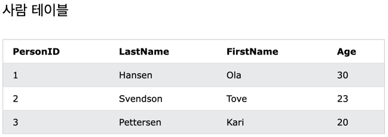
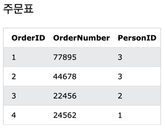
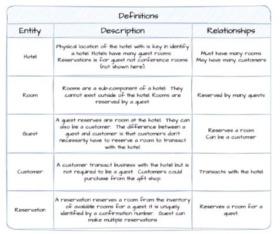
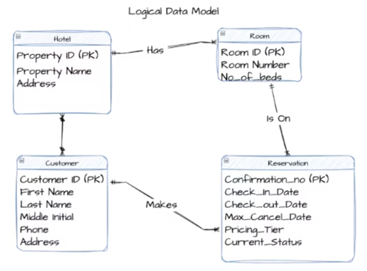
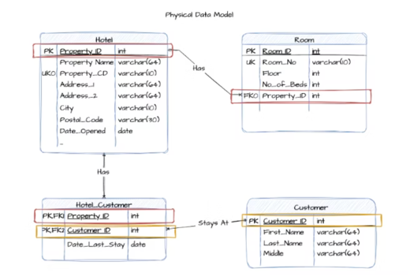
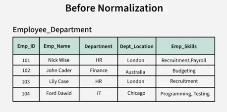
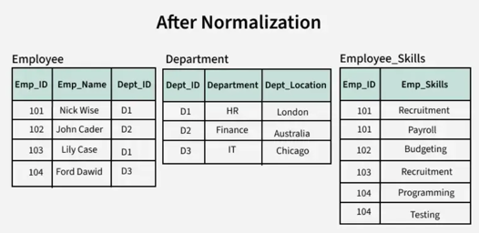

# 🎯 핵심 키워드

- 외래키
- 기본키
- ER 다이어그램
- 복합 키
- 연관관계
- 정규화
- 반 정규화

---

## **외래키**
**외래키**는 한 테이블의 필드로 `PRIMARY KEY`가 다른 테이블의 필드를 참조한다.
- 예시

위 예시를 통해 다음과 같은 사실을 알 수 있다.
- `Orders` 테이블의 `PersonID` 열이 `Persons` 테이블의 `PersonID` 열을 가리킨다.
- `Persons` 테이블의 `PersonID` 열은 `Persons` 테이블의 `PRIMARY KEY`로 존재한다.
- `Orders` 테이블의 `PersonID` 열은 `Orders` 테이블의 `FOREIGN KEY`로 존재한다.

이렇듯 Orders 테이블에 PersonID 열은 실제로 존재하는 Persons 테이블의 값이어야 하기 때문에

FOREIGN KEY는 두 테이블 사이에 제약 조건을 걸어 잘못된 데이터가 삽입되는 것을 막아준다는 사실을 알 수 있다.

### 외래키 제약 조건
IBM의 공식 문서에 따르면, 외래 키 제약 조건은 `"사용자가 테이블 간 및 테이블 내에서 필수 관계를 정의할 수 있도록"`해주며,
한 테이블의 열이 다른 테이블의 `기본 키` 또는 `고유 키`를 참조하도록 설정함으로써, 데이터 간의 일관성과 정확성을 유지하는 역할을 한다.

- 특징
  - 다른 테이블의 `기본 키`를 참조하지만, `유니크(UNIQUE)` 제약 조건이 있는 다른 열을 참조할 수도 있다
  - 외래 키 제약 조건이 적용된 열에 값을 넣을 때, 그 값이 참조하는 다른 테이블의 특정 열에 반드시 존재해야 한다
    만약 그 값이 존재하지 않으면, 외래 `키 위반 오류`가 발생한다.
### 자체 참조
다른 테이블 뿐만 아니라, 같은 테이블의 다른 열을 참조할 수 있으며, 이를 `자체 참조`라고 한다.
- 예시    
  - 직원 테이블에 상사와 직원이 존재할 때 각 직원 마다 상사가 존재하면
  - 직원 테이블의 **"직원 ID**는 기본 키이고, **상사 ID**는 **직원 ID**를 참조하는 외래 키로 설정될 수 있다.

### 참조 무결성
참조 무결성은 데이터 간의 관계가 일관되게 유지되도록 하기 위해서 **외래 키 제약 조건**을 통해 

한 테이블의 데이터가 다른 테이블의 데이터와 정확하게 일치하도록 보장하는 원칙이다.
- 예시
  - 영업 사원 테이블과 판매 주문 테이블이 존재한다고 가정했을 때
    - 만약 기본 키 테이블(예: 영업 사원 테이블)의 데이터가 변경되거나 삭제되면, 영업 사원의 ID가 테이블의 판매 주문에 사용되는 경우
    - 외래 키로 참조된 데이터(예: 판매 주문 테이블)가 고아 데이터가 되어 연결이 끊어질 수 있다.

따라서, 기본 키 테이블에서 데이터를 삭제하거나 변경하려고 하면, 

외래 키 제약 조건이 이를 차단하여 데이터의 연결이 깨지지 않도록 한다.

### 연쇄 참조 무결성 제약 조건
**연쇄 참조 무결성 제약 조건**은 부모 테이블에서 데이터를 삭제하거나 업데이트할 때

이와 관련된 자식 테이블에서 외래 키가 어떻게 처리될지를 정의하는 제약 조건이다.
삭제와 업데이트 작업에 대해 다음 옵션을 적용할 수 있다.

 옵션

### 1. NO ACTION
   - 부모 테이블의 데이터가 삭제되거나 업데이트될 때, 오류가 발생하고 해당 작업은 `롤백`된다.
   - 즉, 부모 테이블의 데이터 변경이 자식 테이블에 영향을 주지 않으며, 데이터베이스가 `오류`를 발생시키고 변경 `작업을 취소`한다.
### 2. CASCADE
   - 부모 테이블의 행이 삭제되거나 업데이트되면, 자식 테이블에서도 해당 행이 자동으로 삭제되거나 업데이트된다.
   - 예를 들어, 부모 테이블에서 특정 데이터가 삭제되면 자식 테이블에서도 그 데이터와 관련된 모든 항목이 삭제된다.
   - `ON DELETE CASCADE` 또는 `ON UPDATE CASCADE`로 설정하여 부모 테이블의 변화에 따라 자식 테이블이 자동으로 변화하도록 할 수 있다.
### 3. SET NULL
   - 부모 테이블에서 해당 행이 삭제되거나 업데이트될 때, 외래 키로 연결된 자식 테이블의 모든 외래 키 값이 `NULL`로 설정된다.
   - 즉, 부모 테이블의 행이 삭제되면 자식 테이블의 외래 키가 `NULL`로 처리된다.
### 4. SET DEFAULT
   - 부모 테이블에서 해당 행이 삭제되거나 업데이트될 때, 자식 테이블의 외래 키 값이 설정해둔 `기본값`으로 설정된다.
   - 즉, 부모 테이블의 데이터가 변경되면 자식 테이블의 외래 키가 기본값으로 바뀐다.

참조 문헌 :

https://learn.microsoft.com/en-us/sql/relational-databases/tables/primary-and-foreign-key-constraints?view=sql-server-ver16
https://www.w3schools.com/sql/sql_ref_foreign_key.asp

## **기본키**
테이블에는 일반적으로 테이블의 각 행을 고유하게 식별하는 값이 존재하는데 이를 **기본키(PK)**라 한다.

기본 키를 더 자세히 알기 위해서 슈퍼키, 후보키 정의를 통해 명확하게 알 수 있다.

**슈퍼키(Super Key)**

- 각 행을 유일하게 식별할 수 있는 하나 또는 그 이상의 속성들의 집합
- **유일성 :** 하나의 키로 특정 행을 바로 찾아낼 수 있는 고유한 데이터 속성
    - 주민번호, 학번 등 고유한 데이터 속성
    - 이름+나이 같은 경우는 슈퍼키가 되기 애매하다.
    - 이름+나이가 모두 동일한 사람이 존재할 수 있기 때문에

**후보키(Candidate Key)**

- 슈퍼키 중에서 최소성을 만족하는 키
- 슈퍼키를 구성하는 속성 중 어떤 속성이라도 제거하면 더 이상 유일하게 식별할 수 없게 되는 속성들의 **최소 집합**
- ex) 학생 `(학번, 이름, 학과, 주소)` 테이블에서 `{학번}`은 후보키이다.
- 또한, `{학번}`은 슈퍼키이다. (유일성 만족)
- `{학번}`에서 어떤 속성도 제거할 수 없다. (최소성 만족)
- `{학번, 이름}`은 슈퍼키이지만 후보 키는 아니다(유일성은 만족하지만 최소성 만족 x)
    - 더 자세한 이유를 설명하면 `{학번, 이름}`에서 `{이름}`을 제거해도 슈퍼키를 만족하기 떄문

> ⇒ 슈퍼키 : “이것만 있으면 유일하게 찾을 수 있음” (유일성 O, 최소성 X)  
⇒ 후보키: “이것만 딱 있어야 유일하게 찾을 수 있다. 하나라도 빠지면 안됨” (유일성 O, 최소성 O)

- 기본키는 위에서 살펴본 후보키들 중 하나를 선택한 키로 정의한다.
- `최소성과 유일성을 만족하는 속성이라고 이해하면 더 쉽게 이해할 수 있다.

- 특징 
  - 테이블에서 기본키는 오직 `1개`만 지정 가능
  - `NULL`값을 절대 가질 수 없고, 다른 튜플과 중복된 값을 가질 수 없다.

참조 문헌 :

https://learn.microsoft.com/en-us/sql/relational-databases/tables/primary-and-foreign-key-constraints?view=sql-server-ver16

## **ER 다이어그램**
Entity-Relationship Diagram의 약자로 해석하자면

엔티티 간의 관계를 시각적으로 나타낸 다이어그램이다.
데이터베이스 설계 과정에서 `개념적 설계 단계`의 산출물이라고 할 수 있다.

### 데이터베이스 설계 과정
데이터베이스 설계 과정은 `개념적 설계`, `논리적 설계`, `물리적 설계`의 세 단계로 진행된다.

### 개념적 설계

사용자의 요구 사항을 분석하여 관리해야 할 주요 개체(Entity)와 그들 간의 관계(Relationship)를 정의한다.

현실 세계의 구조를 추상화하고, 이를 기반으로 ER 다이어그램을 작성

정리하자면, 다음과 같다.

- 사용자 요구 사항 수집 및 분석
- 개체 및 관계 정의
- ER 다이어그램 작성

### 논리적 설계

개념적 설계를 기반으로 데이터베이스의 논리적 구조를 정의한다.

이 과정에서 정규화 기법을 적용하여 데이터 중복을 최소화하고, 데이터 무결성을 확보한다.

정리하자면, 다음과 같다.

- 개념적 모델을 논리적 모델로 변환
- 정규화 수행
- 무결성 제약 조건 정의

### 물리적 설계

논리적 설계를 기반으로 데이터베이스의 실제 저장 구조와 접근 방식을 결정
- 인덱스 설계
- 저장 공간 및 파일 구조 결정
- 데이터 접근 경로 최적화

참조 문헌:

https://en.wikipedia.org/wiki/Entity%E2%80%93relationship_model

그림 출처:

https://www.thoughtspot.com/data-trends/data-modeling/conceptual-vs-logical-vs-physical-data-models

## **복합 키**

**복합 키**는 데이터베이스 테이블에서 레코드를 고유하게 식별하기 위해 두 개 이상의 열(컬럼)을 `결합`하여 구성하는 `기본 키`이다.

### 복합 키의 필요성
- 단일 열로는 테이블의 행을 고유하게 식별할 수 없을 때, 여러 열을 조합하여 고유 식별자를 만들 수 있다.
- 다대다 관계를 표현하는 중간 테이블에서 주로 사용된다.
-  각 행의 유일성을 보장해준다.

### 복합 키 사용 이점
- 복잡한 관계를 표현할 수 있는 유연성을 제공
- 중복 없이 정확하게 데이터를 구분할 수 있어 참조 무결성이 좋아진다.

- 특징
    - 복합 키의 개별 열은 그 자체로는 고유하지 않을 수 있다.
    - 예를 들어, `이름`과 `나이`는 그 자체로 기본키가 될 수 없지만, 이를 결합해서 `{이름, 나이}`을 복합키로 사용하는 개념
    - 단점
        - 요구 사항이 변경되면 엔티티 형식을 변경해야 할 수도 있다.
        - 자칫 잘못하면 복합 키의 속성 수가 변경되고 모든 외래 키를 업데이트해야 하기 때문에 불편할 수 있다.

참고 문헌:

https://www.geeksforgeeks.org/composite-key-in-sql/
https://www.geeksforgeeks.org/composite-key-in-database/

## **연관관계**
IBM 공식 문서에 따르면 연관관계는 `JOIN` 문을 사용하여 데이터를 검색하여 생성된 테이블 간의 연결이다.

연관관계의 종류로는 `일대일`, `일대다`, `다대다`가 있다.

### 일대일(1:1)
두 테이블 모두 관계의 각 측에 하나의 레코드만 가질 수 있다.

예를 들어, 회사 직원 당 하나의 차량이 주어진다 했을 때 직원과 차량은 일대일 관계이다.

### 일대다(1:N)
한 쪽 엔티티가 관계를 맺은 엔티티 쪽의 여러 객체를 가질 때 1:N 연관관계로 두 엔티티 사이의 관계를 정의한다.

예를 들어, 부모와 자식 관계를 생각해보면 

부모는 자식을 1명, 2명, 3명.. 을 가질 수 있기 때문에 부모와 자식 사이의 관계를 1:N으로 정의할 수 있다.

### 다대다(N:M)
한 테이블의 여러 레코드가 다른 테이블의 여러 레코드와 연관되는 관계이다.

- 관계형 데이터베이스에서는 다대다(N:M) 관계를 직접적으로 지원하지 않기 때문에, 
  이를 구현하기 위해 연결 테이블(또는 조인 테이블)을 사용하여 두 개의 1:N 관계로 분해해야 한다.

### 레코드 식별
그리고 위에서 살펴보았던 기본 키, 외래 키, 복합 키를 통해

연관관계 테이블의 레코드를 명확하게 식별할 수 있다.

참고 문헌:

https://www.ibm.com/docs/en/eamfoc/7.6.0?topic=structure-database-relationships
https://www.geeksforgeeks.org/types-of-relationship-in-database/
https://learn.microsoft.com/ko-kr/ef/core/modeling/relationships/many-to-many

## **정규화**
정규화는 데이터베이스 설계에서 데이터베이스의 효율성, 일관성 및 정확성을 개선하는 작업이다.

### 정규화의 필요성
정규화를 하지 않으면 데이터 중복이 발생하여 데이터 무결성을 위협하고

데이터베이스가 증가함에 따라 추가 문제가 발생할 수 있다.

예를 들어 인하대학교에서 학과에 소속된 교수와 교수가 담당하는 과목을 데이터베이스에 저장하는 상황에서
교수, 학과, 담당 과목을 모두 한 테이블에 저장하게 되면 다음과 같은 문제가 발생한다.

1. **데이터 중복**: 한 교수가 여러 과목을 담당하거나 여러 학과에 소속될 경우, 동일한 교수 정보가 여러 번 반복되어 저장된다.

2. **데이터 무결성 문제**: 데이터 중복으로 인해 한 곳에서 정보가 수정되었지만 다른 곳에서는 수정되지 않는 상황이 발생할 수 있다. 
예를 들어, 교수의 연락처 정보가 변경되었을 때, 모든 관련 레코드를 일일이 수정해야 한다.

3. **데이터 삭제 및 갱신의 어려움**: 특정 교수가 퇴사하여 해당 레코드를 삭제하려고 할 때, 그 교수가 담당하던 과목 정보도 함께 삭제될 위험이 있다. 이는 의도치 않은 데이터 손실을 초래할 수 있다.

4. **데이터베이스 확장성 저하**: 모든 정보를 하나의 테이블에 저장하면, 새로운 속성이나 관계를 추가할 때 테이블 구조를 변경해야 하므로 확장성이 저하된다.

따라서, 이를 해결하기 위해 5가지 정규화 형태가 존재한다.

 정규화 형태

### 제1정규형(1NF): 
- 모든 컬럼이 원자값(더 이상 분해할 수 없는 값)을 가져야 한다.

### 제2정규형(2NF): 
- 1NF를 만족하면서, 기본 키의 일부가 아닌 모든 속성이 기본 키 전체에 `완전 함수 종속`이어야 한다.

### 제3정규형(3NF): 
- 2NF를 만족하면서, 기본 키가 아닌 모든 속성이 기본 키에만 의존하고, 다른 비키 속성에 의존하지 않아야 한다.

### 보이스-코드 정규형(BCNF): 
- 모든 결정자가 `후보 키`여야 한다.

### 제4정규형(4NF): 
- 다중값 종속성을 제거하여 하나의 속성이 다른 속성 집합에 독립적으로 종속되지 않도록 한다.

### 제5정규형(5NF): 
- 조인 종속성을 제거하여 테이블을 더 작은 테이블로 분해하더라도 데이터 중복이나 무결성 문제가 발생하지 않도록 한다.

참고 문헌:

https://www.geeksforgeeks.org/introduction-of-database-normalization/
https://www.geeksforgeeks.org/normal-forms-in-dbms/

## **반 정규화**
데이터베이스의 성능 향상과 운영의 편의성을 위해 의도적으로 데이터 중복을 허용하는 최적화 기법이다.
- 비정규화 특징
  - 정규화된 테이블이 아주 클 경우, `조인`을 수행하는 데 많은 시간이 소모될 수 있다는 단점이 있다.
  - 따라서, 이를 해결하기 위해 비정규화 기법을 사용하는 것이다.

예를 들어 다음과 같은 정규화된 테이블이 존재한다고 했을 때

조회시 정규화로 인해 쿼리가 복잡해지고 느려질 수 있는데, 필요한 정보를 얻기 위해 여러 테이블을 조인해야 하기 때문이다.

따라서, 성능을 최적화하기 위해 관련 테이블을 단일 테이블로 결합하여 데이터를 비정규화할 수 있다.

근데 굳이 비정규화를 안 쓰고 `지연 전략(Lazy Loading)`을 사용해서 관련 테이블을 함께 조인해서 조회하는 것을 안 하고
필요할 시점으로 `지연(Lazy)`하는 전략을 사용하면 최적화할 수 있기 때문에 이런 기법도 있다는 것만 알고 가면 될 것 같다.

참고 문헌:

https://en.wikipedia.org/wiki/Denormalization
https://www.geeksforgeeks.org/denormalization-in-databases/

