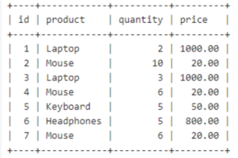

## HAVING
- HAVING 절은 GROUP BY절과 함께 사용되어 집계 함수에 따라 쿼리의 결과를 필터링해주는 구문

<br>

-  기본 구문

```sql
SELECT column1, func(column2)
FROM table_name
GROUP BY column1
HAVING condition;
```
- 구문 분석
  - `column1`: 그룹화할 컬럼
  - `func(column2)`: 집계 함수(COUNT(), SUM(), AVG(), MAX(), MIN() 등)
  - `condition`: 집계 함수나 그룹화된 결과에 대한 조건

<br>

- 사용 예시
  - `sales`라는 이름의 테이블을 생성 후 HAVING절을 사용하는 예시



두 번 이상 판매된 제품을 찾고자 할 때 `쿼리문`은 다음과 같다.

```sql
SELECT product, COUNT(*) 
FROM sales 
GROUP BY 제품 
HAVING COUNT(*) > 1;
```


- 특징
  - 쿼리 결과에는 `HAVING` 조건을 만족하는 그룹만 포함
  - `WHERE`절만으로는 달성할 수 없는 그룹화된 결과에 조건을 적용하는 방법을 제공
  - `HAVING`은 `GROUP BY` 없이는 사용 불가
    - 정확히 말하면 사용은 가능하나 의미가 모호해 권장 x

<br>

- WHERE절과 차이점
  - `WHERE`는 그룹화 전에 행을 필터링 <-> `HAVING`은 집계 후에 그룹을 필터링

참고 자료:

https://www.geeksforgeeks.org/mysql-having-clause/


## LPAD
- 문자열의 왼쪽을 특정 문자 집합으로 채워 지정된 길이로 만들어준다.

<br>

-  기본 구문
```sql
LPAD(string, length, pad_string)
```
- 구문 분석
  - `string` : 채울 대상이 되는 원래 문자열, `VARCHAR` 또는 `BINARY` 값
  - `length` : 결과 문자열의 총 길이, `VARCHAR(UTF-8)`, `BINARY(바이트 수)`
  - `pad_string` : 채울 문자열, 기본값은 공백(' '), `VARCHAR` 또는 `BINARY`

<br>

- 사용 예시
```sql
LPAD('123', 5, '0');
```
- 결과 : `'00123'`
  - 문자열 `'123'`의 길이가 3이므로, 2개의 `'0'`을 앞에 채워서 5자리 문자열로 생성

- 특징
  - 데이터의 포맷을 고정된 형식으로 일관되게 유지해줌
  - 문자열을 오른쪽부터 채워주는 `RPAD` 구문도 존재
  - 


참고 자료:

https://www.mysqltutorial.org/mysql-string-functions/mysql-lpad/

https://docs.snowflake.com/ko/sql-reference/functions/lpad?utm_source=chatgpt.com

https://www.geeksforgeeks.org/lpad-function-in-mysql/