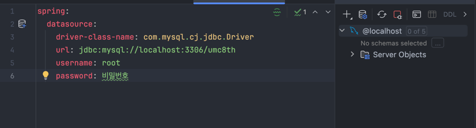
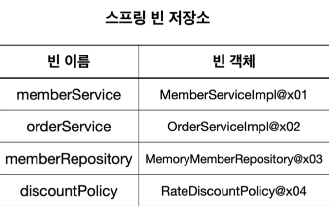

### 실습 인증
---




🎯핵심 키워드
---

### DI

--- 

- 객체 간의 **의존 관계를 외부에서 주입**해주는 방식.
- 객체는 필요한 의존 객체를 **직접 생성하지 않고**, 외부로부터 전달받음.
- 스프링 컨테이너가 객체 생성과 의존성 주입을 관리
    
```java
  @GetMapping("/members")
      public String list(Model model) {
          List<Member> members = memberService.findMembers();
    
          model.addAttribute("members", members);
          return "members/memberList";
      }
```
<br>
`/members` 엔드 포인트에 대한 메서드에서 Model 객체는 스프링에서 자동 주입해준다.
<br>



<br>

### **IoC**

---
- 제어의 역전: **객체의 생성 및 생명주기 제어 권한을 개발자가 아닌 스프링 컨테이너가 가짐**.
- 개발자는 객체 생성이나 관리보다 **비즈니스 로직**에 집중할 수 있음.
- DI는 IoC를 구현하는 대표적인 방법.
  
<br>

### 프레임워크와 API의 차이

---
- **프레임워크 (Framework)**:
  - 개발자가 **프레임워크의 흐름에 맞춰서 코드를 작성**해야 함.
  - **거꾸로 제어(Inversion of Control)** 구조.
  - 예: Spring, Django 등
  
<br>

- **API (Application Programming Interface)**:
   - 기능을 제공하는 **인터페이스 모음**.
   - **개발자가 필요할 때 호출**해서 사용.
   - 예: Java API, OpenAI API 등
  
  <br>

  [라이브러리, 프레임워크, API 차이점](https://www.notion.so/API-18e015e25940807e8de0d946dbedece9?pvs=21) 
    
<br>

### AOP

---
**관점 지향 프로그래밍(AOP)**
    
- 객체 지향 프로그래밍(OOP)에서 모듈성의 핵심 단위는 클래스인 반면, AOP에서는 관점(Aspect)이다.
- 여러 유형과 객체에 걸쳐 있는 관심사를 모듈화 하는 것
    
**특징**
    
- 관심사 분리
- 공통 기능(로깅, 보안, 트랜잭션 등)을 **핵심 비즈니스 로직과 분리하여 관리**.
- Spring에서는 **Proxy 기반**으로 AOP를 지원.
    
**스프링에서의 주요 서비스**
    
- AOP를 활용하여 **선언적 트랜잭션 관리**를 할 수 있다.
    
**선언적 트랜잭션 관리**
    
- AOP를 통해 트랜잭션 관리라는 공통 관심사를 모듈화
- 프록시를 활용하여 메서드 호출을 가로채고 트랜잭션을 자동으로 처리
- 비즈니스 로직과 트랜잭션 관리 로직이 분리되어 코드의 유지보수성과 가독성이 향상
- 예외 발생시 자동으로 롤백되기 때문에 개발자는 비즈니스 로직에 집중 가능
    
<br>

### 서블릿

---

- Java에서 **웹 요청과 응답을 처리**하기 위한 서버측 프로그램
- 특정 비즈니스 로직을 수행하는 전체 단계에서 실제로 유의미한 비즈니스 로직 부분만을 실행하기 위해 필요한 전후 과정이 매우 많다.
- 따라서, 이를 서블릿에서 대신 제공해준다.
- 서블릿 컨테이너 안에 서블릿 객체는 싱글톤으로 관리한다.
- 다만, request, reponse 객체는 항상 새로 생성해준다.

**싱글톤**
  - 객체를 딱 1개만 생성하고, 요청이 올 때 마다 생성된 객체를 공유하는 방법
  - 스프링이 없는 순수한 자바 코드의 경우, 요청이 들어올 때 마다 생성해줘야 하지만
  - 싱글톤 패턴은 한 개만 생성하는 디자인 패턴이다.
  - 스프링 컨테이너를 쓰면 기본적으로 객체를 다 싱글톤으로 관리해준다. (따로 싱글톤 객체로 만들 필요 없음)
  - 주의점
    - 싱글톤 컨테이너를 사용할 때, 무상태로 설계해야 함
    - 특정 클라이언트가 값을 변경할 수 있는 필드가 있으면 안 된다.
    - 즉, 공유하는 지역 변수, 파라미터 등을 사용하면 안 된다.
    - 만약 공유하는 값이 있는 경우 호출할 때 마다 값이 덮어 씌어지는 문제 발생


<br>

참고 자료

https://velog.io/@simhyunmin/%EC%8A%A4%ED%94%84%EB%A7%81-Controller-%EB%B0%8F-Mapping%EC%95%A0%EB%85%B8%ED%85%8C%EC%9D%B4%EC%85%98-%EC%9D%B4%ED%95%B4%ED%95%98%EA%B8%B0

https://velog.io/@simhyunmin/%EB%B9%88-%EB%93%B1%EB%A1%9D-%EB%B0%8F-%EC%9D%98%EC%A1%B4-%EA%B4%80%EA%B3%84-%EC%84%A4%EC%A0%95-%EC%88%98%EB%8F%99-vs-%EC%9E%90%EB%8F%99-%EB%AD%90%EA%B0%80-%EB%8D%94-%EB%82%98%EC%9D%84%EA%B9%8C

https://velog.io/@simhyunmin/%ED%94%84%EB%A1%9D%EC%8B%9C-%EA%B0%9D%EC%B2%B4%EC%99%80-%EC%A7%80%EC%97%B0-%EB%A1%9C%EB%94%A9