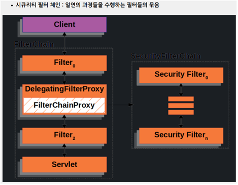
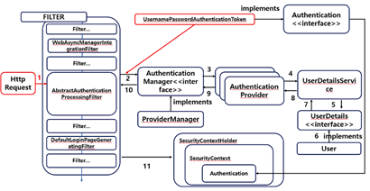

## Spring Security
- 스프링 기반 웹 어플리케이션의 인증과 인가 처리를 담당하는 프레임워크

- 주요 기능
    - 인증 및 권한 관리
        - 사용자 로그인과 특정 리소스에 대한 권한을 검사한다.
        - 폼 로그인, OAuth2, JWT 등 지원
    - 보안 설정
        - 요청 URL과 메서드에 대한 접근 제어를 설정할 수 있다.
        - permitAll(모두 인가), hasRole(특정 권한을 지닌 경우만)
    - 필터 체인
        - 모든 요청은 필터 체인을 통과하고, 각 필터는 특화된 작업을 수행한다.
        - UsernamePasswordAuthenticationFilter, CsrfFilter

- 주요 필터
    - SecurityContextPersistenceFilter : 세션으로부터 인증 정보 처리
    - UsernamePasswordAuthenticationFilter : ID/PW 검증 및 인증 처리
    - AnonymousAuthenticationFilter : 미인증 사용자를 익명으로 설정하여 접근 가능하도록 처리
    - BearerTokenAuthenticationFilter : JWT 토큰에 대한 인증 처리

- 시큐리티의 필터들
- 
1. WAS의 필터 처리 과정 중, DelegatingFilterProxy 가 가로챈다.
2. DelegatingFilterProxy는 FilterChainProxy로 처리를 위임한다.
3. FilterChainProxy는 시큐리티의 FilterChain 을 List 형태로 들고 있는 스프링 빈이다.
4. 시큐리티 의존성 추가 시, 기본으로 등록되는 FilterChain 내 필터를 몇 가지 살펴보면 다음과 같다.
    - DisableEncodeUrlFilter : Response에 세션 id가 인코딩되는 보안 문제 방지용 필터
    - WebAsyncManagerIntegrationFilter : 서블릿에서 비동기 처리 시 동일한 SecurityContext를 참조하도록 하는 필터
    - SecurityContextHolderFilter : SecurityContextRepository 구현체로부터 세션정보를 가져와 SecurityContext에 할당하는 필터
    - HeaderWriterFilter : Response 헤더에 보안 설정 적용해주는 필터
    - CorsFilter : CORS 관련 설정 필터
    - CsrfFilter : csrf 공격 방지 필터
    - UsernamePasswordAuthenticationFilter : 로그인을 처리하는 필터, AbstractAuthenticationProcessingFilter를 상속한다.
    - AnonymousFilter : 해당 필터까지 SecurityContext에 인증 정보가 담겨져 있지 않은 경우 익명 정보를 넣어주는 필터
    - AuthorizationFilter : 가장 마지막 필터, 최종 인가 처리 필터
   ...

- AbstratAuthenticationFilter의 구현체
  - UsernamePasswordAuthenticationFilter
  - OAuth2LoginAuthenticationFilter
  - Saml2WebSsoAuthenticationFilter
  - CasAuthenticationFilter

- 커스텀 필터체인 등록방법
```java
@Configuration
@EnableWebSecurity
public class SecurityConfig {
	@Bean
	public SecurityFilterChain customFilterChain(HttpSecurity http) throws Exception {
		return http.build();
	}
}
```
- 커스텀 필터체인을 등록하면 기본으로 등록되는 필터 중 일부는 등록되지 않음에 유의한다. (UsernameFilter 등등 ...)

- 시큐리티 인증 과정

1. UsernamePasswordFilter와 같은 AbstractAuthenticationProcessingFilter의 구현체가 오버라이딩한 attemptAuthentication() 메서드를 수행한다.
2. 해당 메서드는 AuthenticationManager에게 인증 작업을 위임하고 반환 값을 리턴하는 형식이다.
3. AuthenticationManager는 인증을 진행하는 인터페이스이며, 구현체는 ProviderManager이다.
4. ProviderManager는 여러개의 AuthenticationProvider를 가지고 있어서, 어떤 유형의 인증을 해야하는지를 support()로 확인하여 적절한 AuthenticationProvider 구현체를 선택해 인증을 처리하도록 한다.
5. AuthenticationProvider들은 내부적으로 UserDetailsService와 UserDetails를 사용한다.


## 인증(Authentication)과 인가(Authorization)
- 인증
    - 사용자가 누구인지 신원을 확인하는 과정
    - 로그인과 비밀번호를 받아 사용자를 확인
    - JWT와 같은 토큰을 받아 사용자를 확인

- 스프링 시큐리티의 인증과정
    - AbstractAuthenticationProcessingFilter -> AuthenticationManager -> AuthenticationProvider 의 과정을 의미한다.
    - 반환된 Authentication 객체를 SecurityContextHolder에 저장
    - 사용자의 인증 정보와 권한을 담고 있어 이후 인가 필터(AuthorizationFilter)에서 사용됨

- 인가
    - 인증된 사용자가 무엇을 할 수 있는지 확인하는 과정
    - 권한에 따라 특정 리소스에 대한 액세스를 결정한다.

- 스프링 시큐리티의 인가과정
    - AuthorizationFilter에서 Authentication에 담긴 권한을 바탕으로 리소스 접근 허용 여부를 결정한다.
    - 실패 시 403 Forbidden 또는 401 Unauthorized (ExceptionTranslationFilter)

- 인증 및 인가 세팅
```java
@Bean
public SecurityFilterChain securityFilterChain(HttpSecurity http) throws Exception {
    http
            .authorizeHttpRequests((requests) -> requests
                    .requestMatchers("/", "/home", "/signup", "/css/**").permitAll() // 인증이 필요하지 않음
                    .requestMatchers("/admin/**").hasRole("ADMIN") // 인증 + ADMIN 권한이 필요함
                    .anyRequest().authenticated() // 인증이 필요함
            );

    return http.build();
}
```


## 세션과 토큰
- 세션
  - 사용자에 대한 상태를 서버에 저장하는 방식
  - 각 사용자마다 고유 세션 ID 발급해주고, 이 값만 쿠키로 넘긴다.
  - 상태 정보를 메모리나 DB에 저장하여야 하므로 서버 쪽 자원을 사용해야한다.

- 토큰
  - 사용자에게 최소한의 인증 정보를 암호화 시켜 넘겨주고, 토큰을 API 호출 시 넘기고 서버가 검증하도록 하여 인증/인가 처리
  - 보통 사용하는 토큰은 JWT(Json Web Token)이다.
  - 생성/검증 라이브러리를 지원하여 적용이 간편하다.
  - 토큰 자체는 stateless 지만, 실제로 사용하는 경우에는 보안 상 이유로 리프레시 토큰을 서버 쪽에 저장해야한다.


## 액세스 토큰과 리프레시 토큰
- 액세스 토큰 : API 요청 시 인증을 위해 사용하는 토큰
- 리프레시 토큰 : 액세스 토큰이 만료되었을 때, 재발급을 위해 사용되는 토큰

- 토큰을 하나만 쓰면 안되나?
  - 토큰이 탈취당하면 TTL 동안은 유효한 요청으로 처리된다. 따라서 유효기간이 짧은 토큰 하나, 해당 토큰을 재발급하주는 토큰 하나를 발급해주는 것이다.

- RTR 기법
  - 리프레시 토큰을 사용할 때마다 '새로운 리프레시 토큰 + 액세스 토큰'을 함께 재발급
  - 보통 Redis에 리프레시 토큰을 저장하고, 발급 후 이전 리프레시 토큰은 폐기한다.
  - 만약 동일한 리프레시 토큰을 재사용한다면 로그아웃을 시킨다.