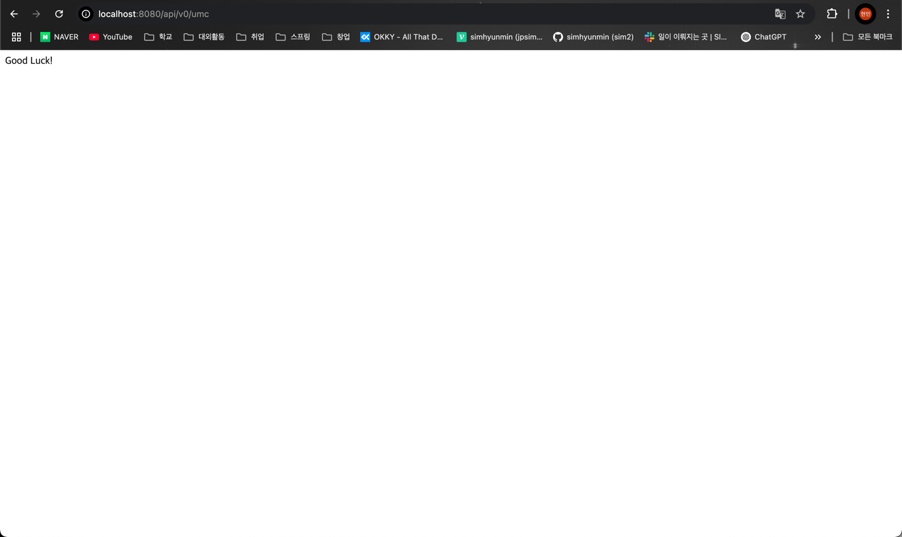
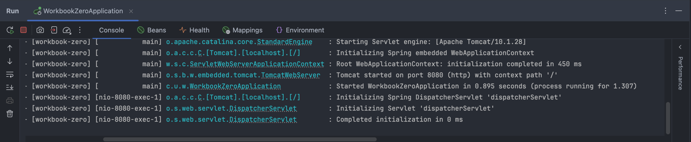

## 🔥미션

### ✅ 너디너리 홈페이지 접속하는 과정 적어보기
**1. 주소창에 도메인 이름 입력 후 웹 브라우저가 URL 해석**
- 브라우저가 사용자가 입력한  URL을 분석
  - ex) https://www.example.com/path?name=sim
    - 프로토콜: https (HTTP, HTTPS 등)
    - 도메인 이름: www.example.com
    - 경로 (Path): /path
    - 쿼리(Query Parameters): ?name=sim
    
**2. DNS 조회**
- 브라우저는 도메인 이름(www.example.com)을 IP 주소로 변환
- 조회 순서
  - 로컬 DNS 캐시 -> 운영체제 DNS 캐시 -> ISP(인터넷 서비스 제공자)의 DNS 서버 
    ->루트 네임서버
- 도메인의 IP 주소 (ex: `192.168.1.1`)을 받아오기

**3. 서버에 HTTP 요청 보내기**
- 홈페이지의 IP 주소 및 내 IP 주소를 포함한 패킷 생성
- 생성된 패킷은 내가 속한 Access Network를 통해 Network Core로 전달
- 네트워크 상 라우터들이 패킷 내 목적지 IP를 확인하고 최적 경로로 패킷 전달
- 패킷이 Network Edge(목적지 서버 근처 네트워크 장비)에 도달
- 서버 내부에서 패킷을 받아 요청 처리 후, 응답 패킷(HTML, CSS 등) 생성

**4. 응답 패킷 수신 및 웹페이지 렌더링**
- 응답 패킷이 내 컴퓨터로 전송
- 브라우저가 HTML, CSS 등을 해석하고 웹페이지 렌더링

**5. 너디너리 웹사이트 접속 완료**

### ✅ 깃허브 clone 받아서 실행하고 나온 페이지 스크린 샷 찍기

