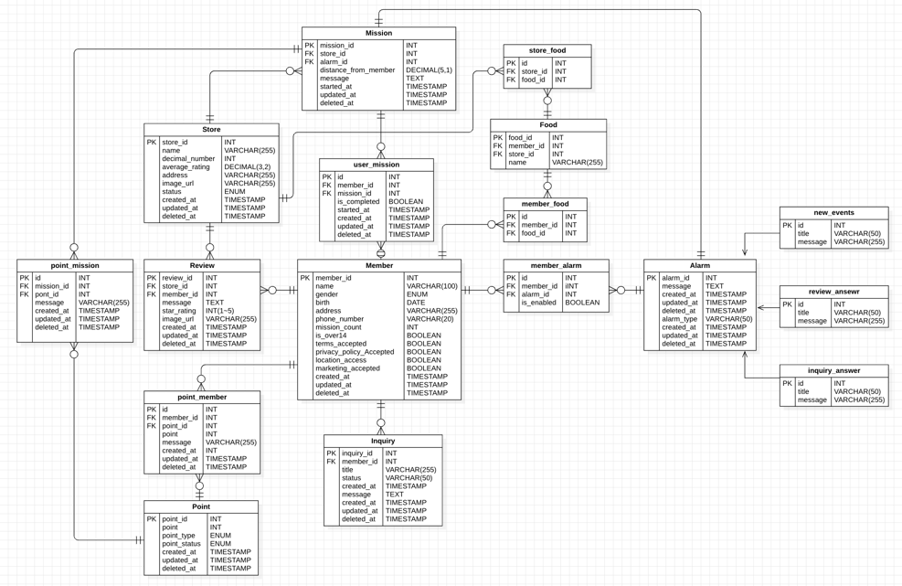
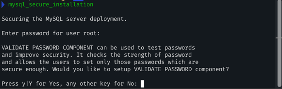
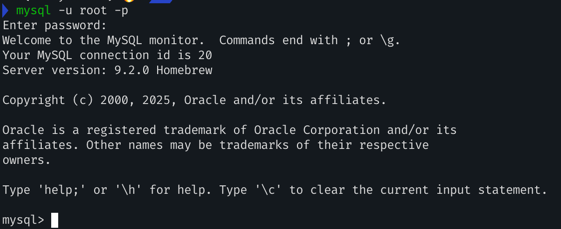
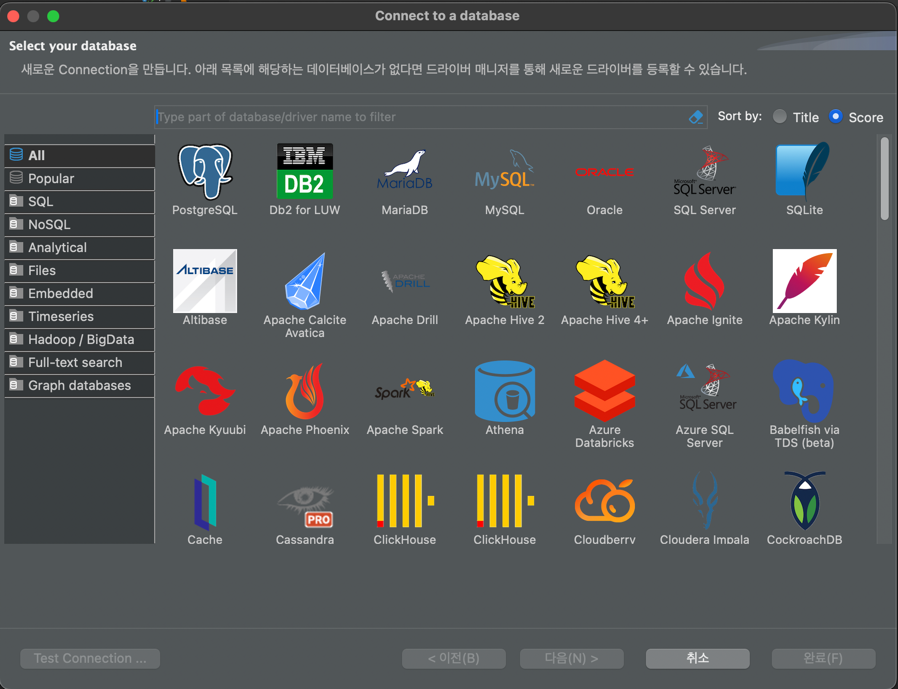
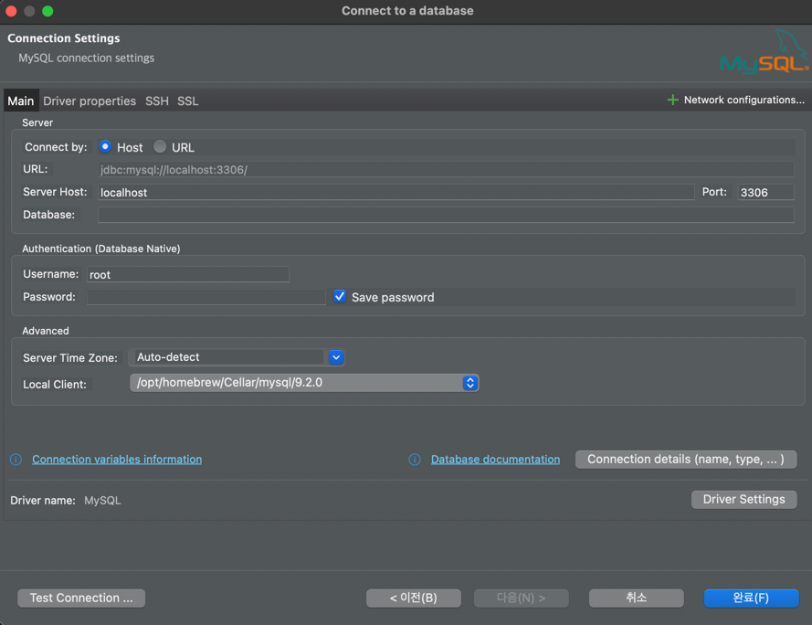
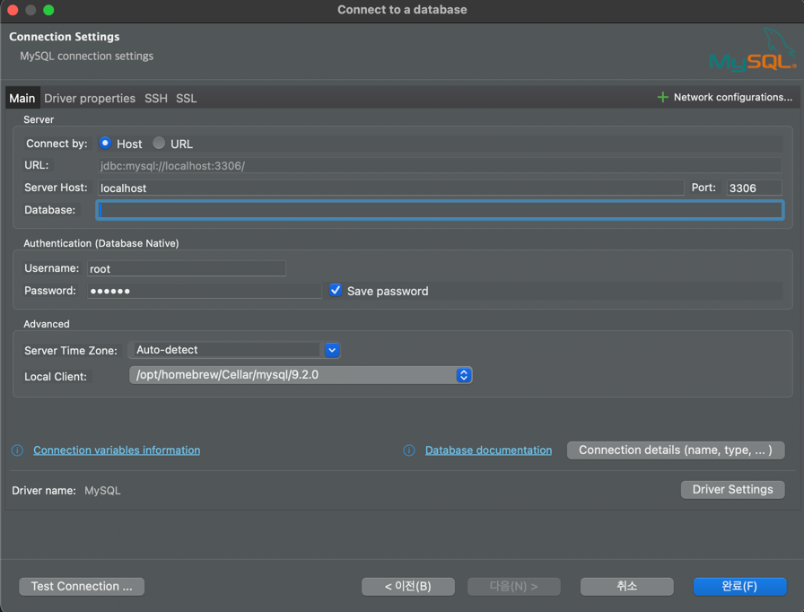
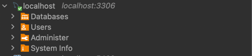

## 🔥미션

---

1. 주어진 IA(기획 플로우)와 와이어 프레임(디자인 프로토타입)을 보고 직접 데이터베이스를 설계해오기, 위에서 언급한 경우를 다 적용해서 할 것
2. 이름 글자 수 등 세부적인 부분은 원하는 대로 해도 됨!
3. 각 지역 별로 가게들이 있으며 가게를 방문하는 미션을 해결하며 포인트를 모으는 서비스
    1. 모든 지역마다 10개의 미션 클리어시 1000 point 부여로 고정

**최소한 로그인/회원가입, 미션, 홈 화면에 필요한 데이터는 설계를 해야함, 되어있지 않다면 원 아웃**

***미션 난이도 완화를 위해 지도 검색 기능 전부 pass, 저 부분은 설계 하지 마세요***

***내 포인트 관리, 알 부분도 설계하지 마세요***

***사장님이 자신의 점포 관리하는 부분도 설계 대상에서 제외입니다.***

물론 원하시면 하셔도 됩니다. 😉

### 미션 사진, ERD Diagram

## ✅ 실습 인증
-  로컬 DB 설정
-  DB 접속
---

### 1. **homebrew**를 이용해 mysql 설치

### 2. `mysql.server start` 커맨드를 통해 mysql 서버 실행

다음과 같이 뜨면 성공

### 3. `mysql_secure_installation` 커맨드를 통해 mysql 기본 세팅

다음과 같은 창이 뜨면

아래 토글 안에 정리된 내용에 따라 입맛에 맞게 설정

  
내용 확인

   **1. 비밀번호 복잡도 검사**
   
   
   
   VALIDATE PASSWORD COMPONENT can be used to test passwords
   and improve security. It checks the strength of password
   and allows the users to set only those passwords which are
   secure enough.
   
   Would you like to setup VALIDATE PASSWORD component?
   Press y|Y for Yes, any other key for No
   
   비밀번호 복잡도 검사를 적용할 것인지 설정하는 과정입니다. 복잡도 검사를 적용하게 된다면 다음과 같은 비밀번호 조건이 붙습니다.
   - 최소 8자리 이상의 비밀번호
     - 최소 1개의 영문자
     - 최소 1개의 특수문자
     - 최소 1개의 숫자
   
   간단하게 비밀번호를 설정해 두실 분들은 No로 진행하면 됩니다.
   
   이후 설정할 비밀번호 입력이 나오는데 입력해도 보이지 않는 것이 정상입니다.
   
   **2. 익명의 사용자 삭제**
   
   
   By default, a MySQL installation has an anonymous user,
   allowing anyone to log into MySQL without having to have
   a user account created for them. This is intended only for
   testing, and to make the installation go a bit smoother.
   You should remove them before moving into a production
   environment.
   
   Remove anonymous users? (Press y|Y for Yes, any other key for No)
   
   익명의 사용자를 삭제할 것인지 물어봅니다.
   설치 과정에서 테스트와 설치를 좀 더 원활하게 진행하기 위해 생성되었던 계정인데 Yes로 삭제해 줍니다.
   
   **3. root 계정 원격 접속 차단**
   
   
   Normally, root should only be allowed to connect from
   'localhost'. This ensures that someone cannot guess at
   the root password from the network.
   
   Disallow root login remotely? (Press y|Y for Yes, any other key for No)
   
   root 계정을 원격(외부)에서의 접속을 차단할 것인지 묻습니다. 일반적인 경우라면 root 계정은 원격 접속은 차단해 두는 것이 권장됩니다. Yes로 차단을 하여 주시면 됩니다. 원격작업이 필요한 경우는 root 말고 db 계정을 따로 생성하여 원격 권한을 주는 것이 가장 바람직합니다.
   
   **4. 테스트 데이터베이스 삭제**
   
   
   By default, MySQL comes with a database named 'test' that
   anyone can access. This is also intended only for testing,
   and should be removed before moving into a production
   environment.
   
   Remove test database and access to it? (Press y|Y for Yes, any other key for No)
   
   테스트 데이터베이스를 삭제할 것인지 물어봅니다.
   필요 없으니 과감히 Yes로 버려주셔도 됩니다.
   
   **5. 현재까지의 변경사항 즉시 적용**
   
   Reloading the privilege tables will ensure that all changes
   made so far will take effect immediately.
   
   Reload privilege tables now? (Press y|Y for Yes, any other key for No)
   
   
   
   Yes를 통해 변경사항을 즉시 적용시켜 줍니다.
   
   출처 : 
   https://programmerjoon.tistory.com/23

### 4. mysql 로그인
`mysql -u root -p`를 통해 접속 
이렇게 뜨면 성공이다.

### 5. DB 접속
**DBeaver**를 통해 접속했다.
 
 

이렇게 생긴 아이콘 클릭 후

해당 화면에서 `MySQL` 클릭

그러면 다음과 같은 창이 뜰 것이다.

여기서 Database는 현재 만들어둔 게 없기 때문에 user/password 부분, port 부분만 신경쓰고 
나머지는 기본 설정 그대로 유지한 채로 연결

그러면 다음과 같이 연결된 초록색 체크 표시로 연결된 모습을 확인할 수 있다.

