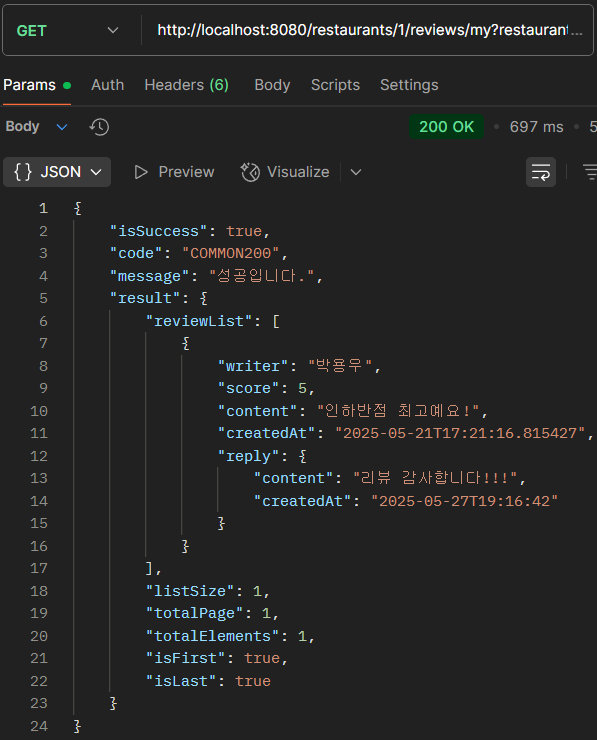
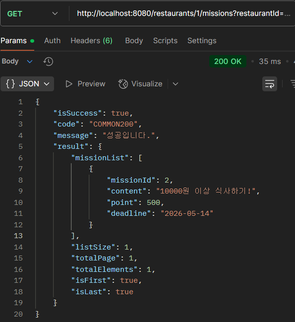
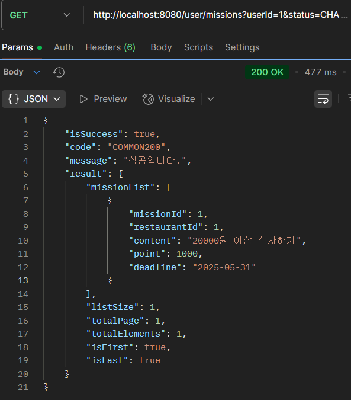
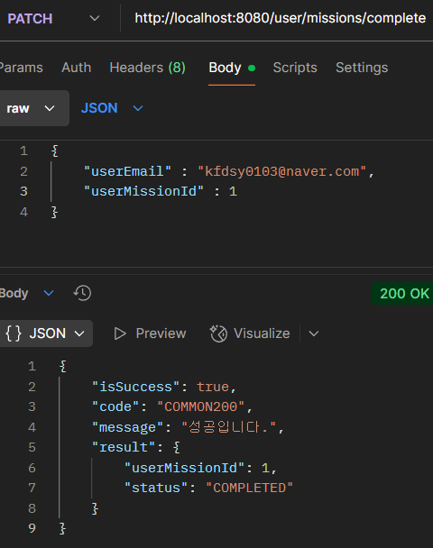

## 1. 내가 작성한 리뷰 목록 조회
- 

## 2. 특정 가게의 미션 목록 조회
- 

## 3. 내가 진행중인 미션 목록 조회
- 

## 4. 진행중인 미션 진행 완료로 바꾸기
- 


## 시니어 미션 1. Page와 Slice의 비교
- 아래는 ‘내가 도전 중인 미션 조회’ API이다.

```bash
# Page 적용 시, Count 쿼리 발생
Hibernate: 
    select
        ...
    from
        user u1_0 
    where
        u1_0.id=?
Hibernate: 
    select
        ...
    from
        user_mission um1_0 
    where
        um1_0.user_id=? 
        and um1_0.status=? 
    limit
        ?, ?
Hibernate: 
    select
        count(um1_0.id) 
    from
        user_mission um1_0 
    where
        um1_0.user_id=? 
        and um1_0.status=?
```

- Page의 장단점
    - 장점
        - getTotalPages(), getTotalElements() 등 전체에 대한 정보를 알아낼 수 있다.
        - 프론트 쪽으로 총 몇 개의 페이지가 존재하는지 전달할 수 있다.
    - 단점
        - count() 쿼리가 추가로 실행되어 성능 이슈가 발생할 수 있다.
        - 만약 테이블의 크기가 크거나 조인된 경우라면 속도가 느릴 수 있다.

```bash
# Slice 적용 시, limit+1로 isNext 정보만 가져온다.
Hibernate: 
    select
        ...
    from
        user u1_0 
    where
        u1_0.id=?
Hibernate: 
    select
        ...
    from
        user_mission um1_0 
    where
        um1_0.user_id=? 
        and um1_0.status=? 
    limit
        ?, ?
```

- Slice의 장단점
    - 장점
        - count 쿼리를 수행하지 않아 성능이 더 좋다.
        - 무한 스크롤 구현 시 사용된다.
    - 단점
        - 전체 페이지 수, 전체 엔티티 개수 정보를 알 수 없다.
        - isLast 정보는 hasNext()를 통해서 판단해야 한다.
        - 프론트로 제공되는 정보가 한정적이다.


- 사용 시점 정리
    - Page : 정확한 전체 페이지 개수를 필요로 하는 경우 사용
    - Slice : 조회 성능이 중요한 상황, 전체 개수가 중요하지 않고 다음 페이지 정보만 필요한 경우 사용


## 시니어 미션 1. for문과 stream의 비교
- for 문
    - 즉시 실행 : 코드를 한줄씩 즉시 실행하여 최종 결과를 만들어낸다.
    - 라인 별 디버깅이 용이하고, 성능이 우수하다.
    - 병렬 처리를 하려면 수동 구현해야한다.

- stream
    - 메서드 체이닝 방식으로 작성하여 가독성이 우수하다.
    - 내부 동작의 로깅이 어렵다.
    - Stream 객체, Predicate 람다 등을 내부적으로 생성하여, 오버헤드가 존재한다.
    - 지연 실행 : stream은 중간 연산을 정의만 해두고, 실제로 최종 연산이 필요한 시점에 모든 연산을 한꺼번에 처리하는 방식이다.
        - 중간 연산 : .filter(), .map(), .sorted() 등을 의미한다.
        - 최종 연산 : .forEach(), .collect(), .count() 등을 의미하며, 이 시점에 중간 연산이 한꺼번에 처리된다.
    - .parallel()로 병렬 처리를 쉽게 사용하도록 지원한다.

- 사용 시점
    - for : 단순하고 빠른 작업이 필요한 경우, 디버깅/로깅이 중요한 경우, 복잡한 제어 조건이 필요한 경우 사용
    - stream : 필터링/변환/집계 연산이 필요한 경우, 가독성이 중요한 경우, 병렬 처리가 필요한 경우 사용