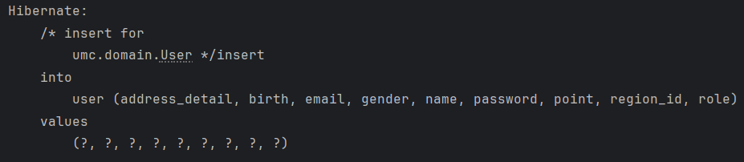
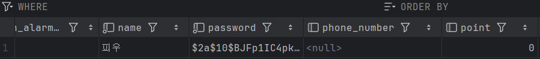
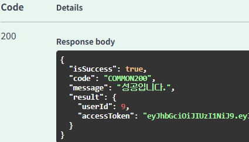
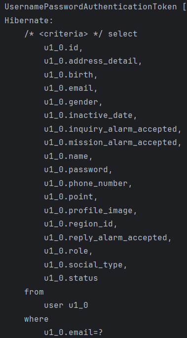
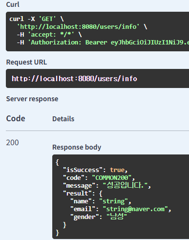
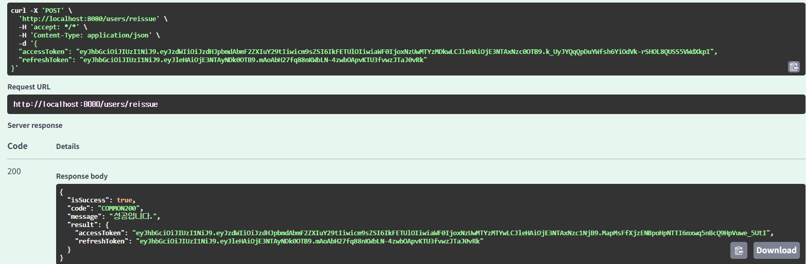
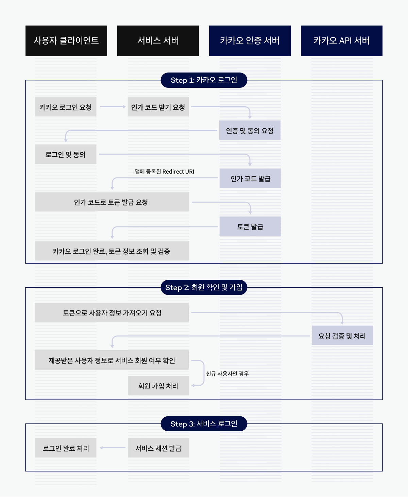
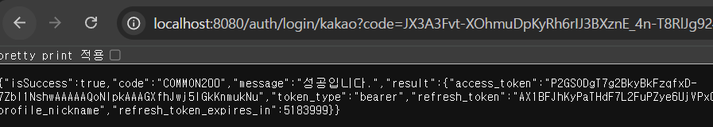
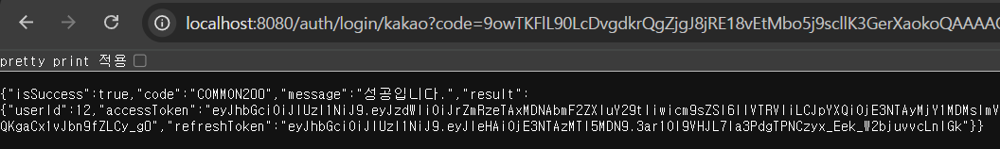
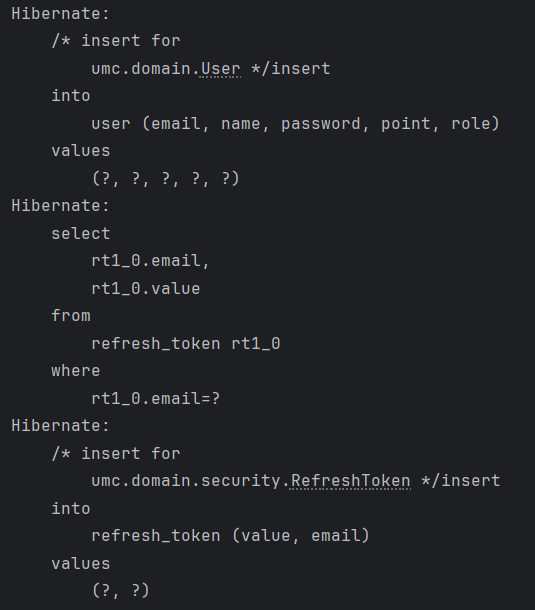

## 실습 1. 세션 방식 구현
- 
- 

## 실습 2. JWT 방식 구현
- 
- 
- 

## 시니어 미션 1. 리프레시 토큰 구현
- 
- /reissue 구현
  - /reissue는 인증이 필요없는 재발급 용도이므로 permitAll()에 추가해주었다.
  - 컨트롤러는 accessToken + refreshToken 2가지를 DTO로 받는다.
  - refreshToken에는 보안 상 유효기간만 들어가도록 하는 것이 좋다. 
  - 따라서 서비스 코드에서는 accessToken을 통해 유저 정보를 파싱 해준다.
  - 또한 refreshToken의 만료 여부를 판단하여 함께 재발급해주고, 응답 DTO로 넘겨주었다.
  - 로그인 시에는 refreshToken도 함께 발행 및 DB에 저장하도록 기존 로그인 로직을 수정해주었다.

## 시니어 미션 2. SNS 로그인 구현 (카카오)
- 
- 방법 1. 인가 코드를 백엔드 서버에서 얻는 방법
- 방법 2. 인가 코드를 프론트엔드에서 얻고, 백엔드 서버로 전달하는 방법
  - 주로 선호되는 방법은 2번이다. 백엔드로 한번 추가적인 API 호출이 발생하지만, 프론트엔드에서 획득하면 페이지 전체를 새로고침하지 않고도 로그인 프로세스를 완료할 수 있어 사용자 경험을 부드럽게 할 수 있기에 선호된다.

- 현재는 프론트를 직접 구현하기 힘들기 때문에 '방법 1'로 인가 코드를 직접 획득하였다.
- 로컬에서만 테스트할 것이므로 리다이렉트 경로는 'http://localhost:8080/auth/login/kakao' 로 카카오 디벨로퍼스에 등록해주었다.

- 토큰 획득
- 
- 사용자가 로그인을 완료하면 'code=~~~' 쿼리 스트링이 전송되고, 이를 컨트롤러에서 받으면 된다.
- 받은 인가 코드로 액세스 토큰을 요청하고, 사용자 정보를 얻어와서 로그인을 처리하면 된다.

- 로그인 완료
- 
- 

- 일단은 구현에만 신경썼기에 개선점을 생각해본다면, '최초 회원 or 기존 회원' 분기 처리하여 최초 회원이면 임시 토큰을 발행해 추가 정보를 입력하도록 하면 좋을 것 같다.
- 또한 실제 협업 환경에서는 백엔드에서 직접 인가코드를 얻기보다, 프론트엔드로부터 인가코드를 받아 회원 정보를 가져오도록 수정해야할 것이다.
